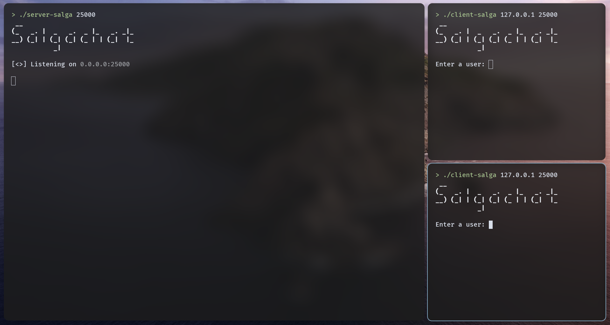
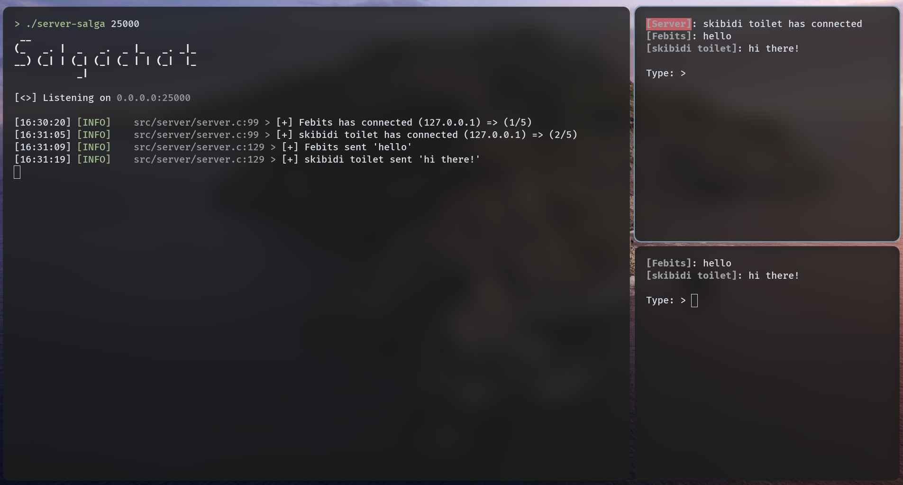
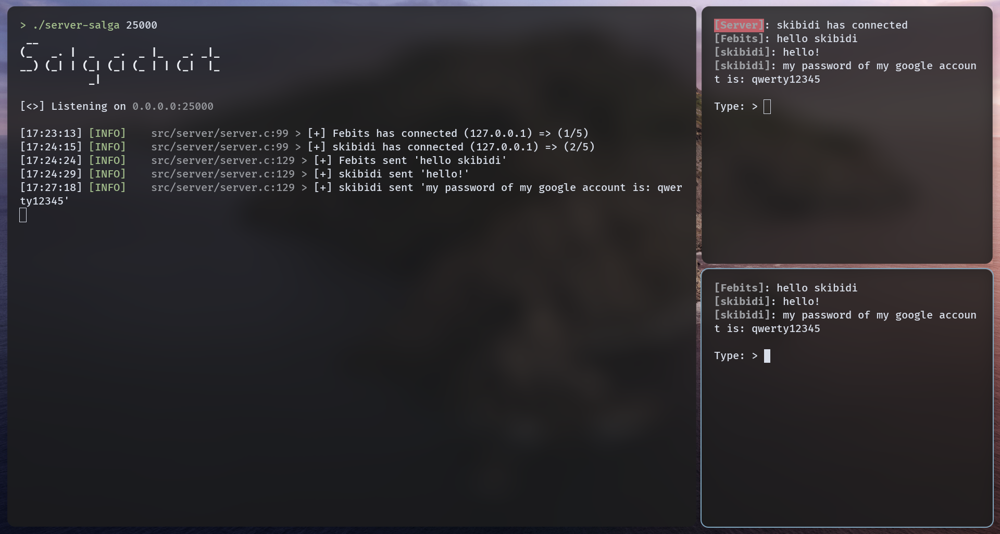
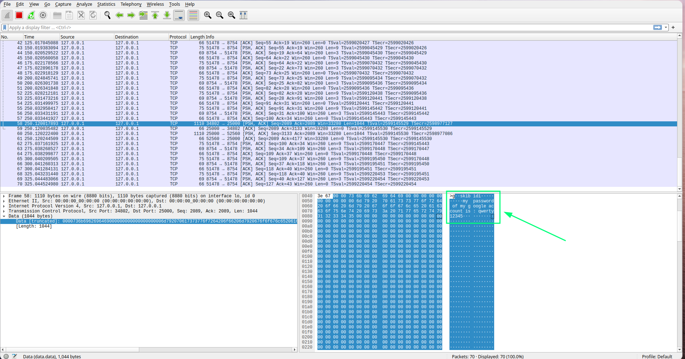
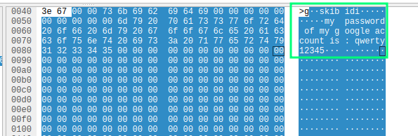
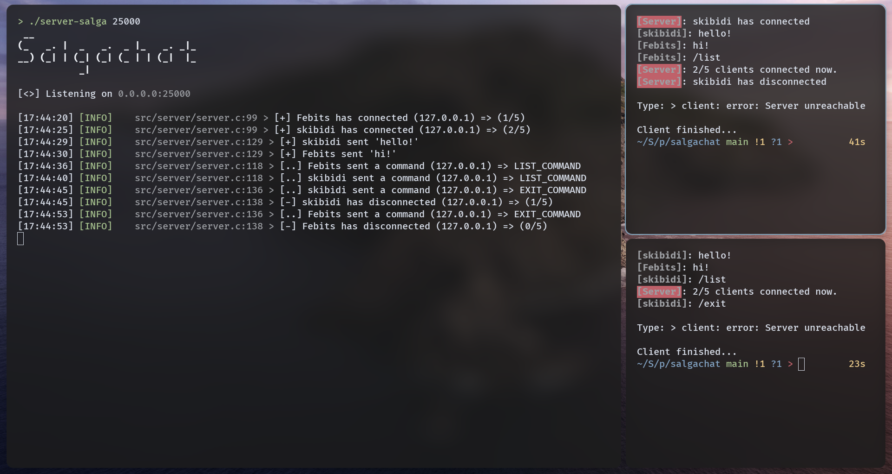

<div style="display: flex; justify-content: flex-start; align-items: center; gap: 15px; flex-direction: row;">
    
    <h1>Salgachat</h1>
</div>

Salgachat ([Salgado](https://pt.wikipedia.org/wiki/Salgado_(comida)) + Chat) is a multiuser chat written in C.

Features:
- Multithread-oriented (POSIX Threads).
- Colors and fancy log on server-side.
- Commands such as `/list`, `/exit`, ...
- Non-canonical input from `stdin` with special handlers.
- Printable messages limit.

## Installation:

Just `git clone` and follow the below:

```bash
cd salgachat
make
```
[Loguva](https://github.com/febits/loguva) and [Libcolor](https://github.com/febits/libcolor) are both created by me, and they are statically linked with the other files.

## Usage:

- Server:
```bash
./server-salga [bind port]
```
- Client:
```bash
./client-salga [server ip] [port]
```
Waiting for users:


Users connected:


Now you can connect the max clients that the server can handle, and have fun with the chatroom! The max clients can be changed by recompiling the server passing through the macro CLIENTSMAX and its value.

### BUT, It's insecure

Yeah, you can talk to your friends with this chat app, but for now, it isonly a 4fun project. So, don’t use it to transmit sensitive information.

- **Why?**

Because it's not encrypted. The whole protocol (user, messages, commands, flags) is sent in plain text. I'll show you below with [Wireshark](https://pt.wikipedia.org/wiki/Wireshark):

Let’s suppose that you want to send your own password from any service on the internet:



Inside wireshark:




In summary, anyone can do a [main-in-the-middle](https://en.wikipedia.org/wiki/Man-in-the-middle_attack) attack, and you know where this ends...

### Commands

For now, there are a few commands available to use:

- `/list` => List the number of users connected now.
- `/exit` => Exit the user from chat.



There are two ways of `QUITING` in salgachat:
- Typing `/exit`.
- Sending a `SIGINT` with Ctrl+C.

## TODO
- [ ] Protocol encryption.
- [ ] Advanced colors for each user.
- [ ] Better handlers to Arrow Keys, such as history system with doubly linked list.
- [ ] Improve CLI usage.
